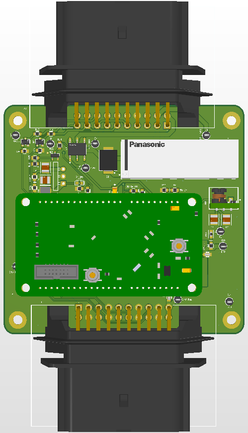

**RES + EBS for SN5**
- 
**Overview**
- 
The RES + EBS V2 is a PCB, standing for Remote Emergency Stop and Emergency Braking System. This board is for UC Berkeley's Formula Electric Club that competes in the Formula SAE competition. 
This PCB is designed to interface with an STM32 MCU and CAN-BUS to control and manage safety-critical power distribution and emergency shutdown response when the vehicle is in autonomous driving mode.

**Features**
- 
* Dual CAN-Bus interface: Supports 2 CAN inputs (CAN1 and CAN2) for robust system communication (Especially important for a board controlling safety systems)
* High Current Power-Switching: Several different types of converters, like LDO and Buck Converters (Step down for components + Power regulation for MCU)
* Safety Relay Logic: Emergency Stop Relays
* Different rail sizes for variable current and voltage capacities
* LED power indicators and Test Points

**Technical Specifications**
- 
* Input Voltage: 24V Unregulated
* MCU: STM32446FRE
* 20 Pin connectors for CAN-Bus, Power, and connection to Indicator Light Boards

**3D View**
- 

*3D model of the RES+EBS V2 PCB featuring the Panasonic safety relay and MicroBasic interface.*

Designed on Altium Designer by Alexander Stankus and Miles Kessner 
